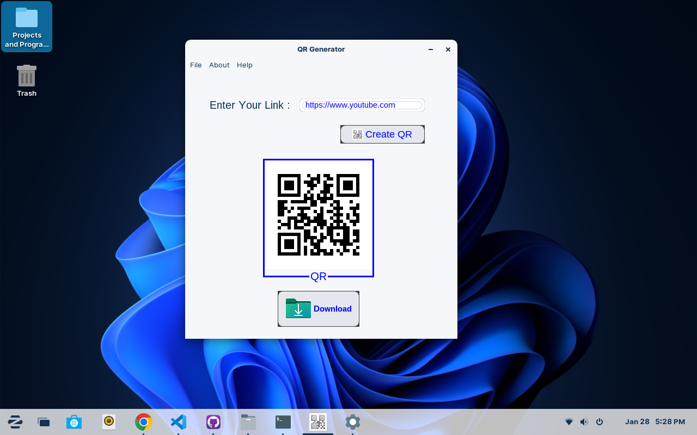
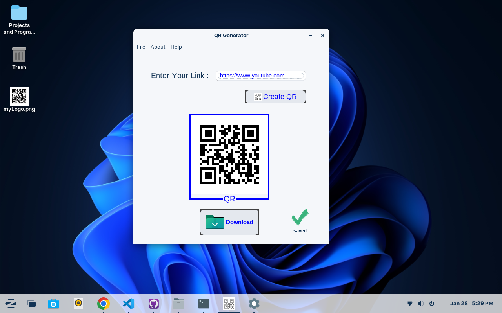
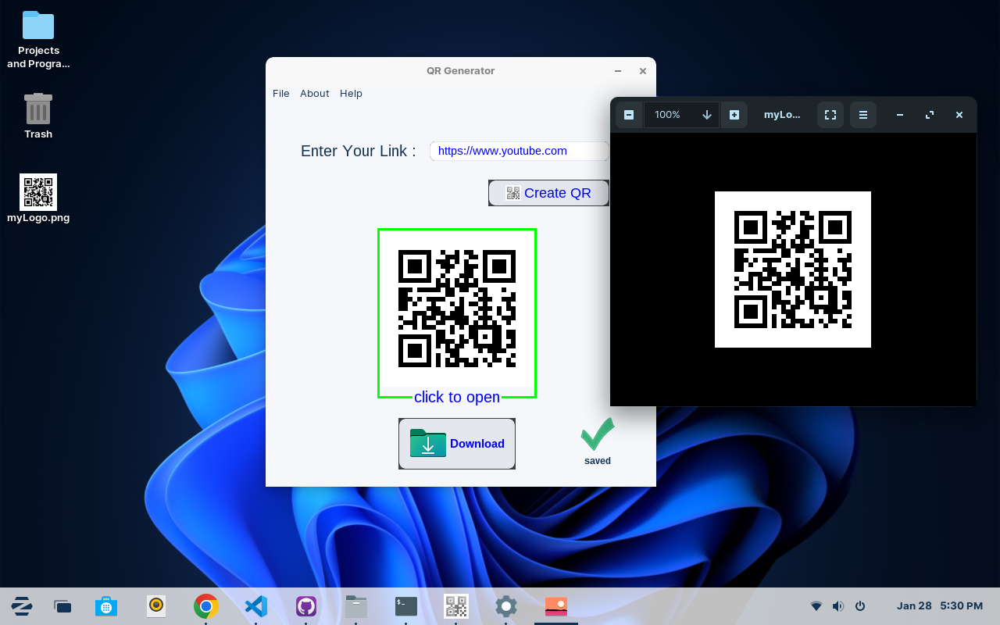
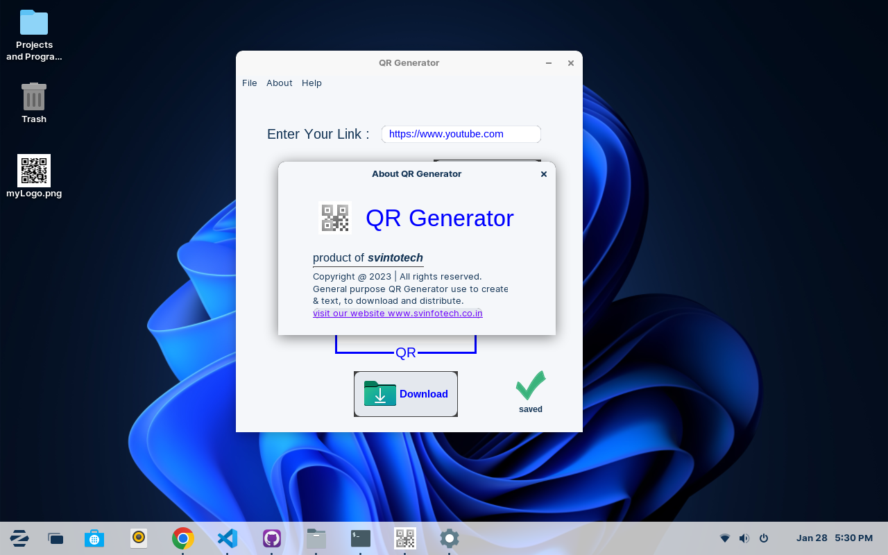

# QR-maker
Generates QR codes. Created in java swing.

## Screenshots

<div style="display: flex;flex-direction: column; grid-gap: 10px;">
    <div style="display: flex; grid-gap: 10px;">
        
        
    </div>
    <div style="display: flex; grid-gap: 10px;">
        
        
    </div>
      <div style="display: flex; grid-gap: 10px;">
        
    </div>
</div>
<br>

## How to use ?

### Run Directly

<b>Windows user : </b>To simply use this application just dubble click on 'QR app.jar'.
<br>
<b>Linux user :</b>open terminal -> locate your directory where you unzip the downloaded file using terminal and use command to run QR-Maker
```bash
java -jar 'QR app.jar'
```

### Run using Eclipse IDE
 <b>Step-1 :</b> After downloading, you have to keep this project on your workspace. Check your workspace from Eclipse also your can change your workspace by <br>
   <b>file->SwitchWorkspace->Other</b>
   and choose your workspace.

<b>Step-2 :</b> Open eclipse IDE : 
     <i>go to file->Open Project from file system-> locate your workspace and select the project(WebChatApp) folder -> click on open -> finish</i>

<b>Step-2 :</b>To run QR-maker <i>right click on QR-maker -> Run As -> Java Application</i>

## Contributing

Pull requests are welcome. For major changes, please open an issue first
to discuss what you would like to change.

Please make sure to update tests as appropriate.